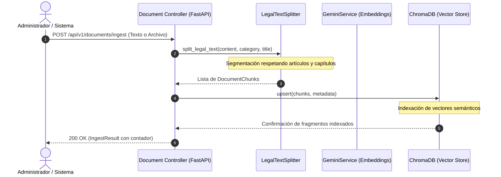
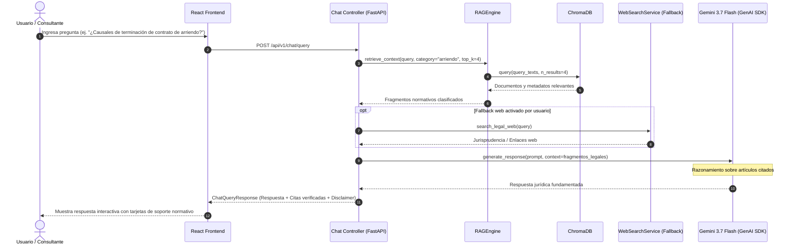

# Documento de Diseño de Arquitectura (DDA) - LegalProp AI
**Proyecto:** LegalProp AI  
**Rol:** Asistente Conversacional Normativo para Arriendos y Propiedad Horizontal  
**Patrón Arquitectónico:** Modelo-Vista-Controlador (MVC) desacoplado para Arquitectura RAG (Retrieval-Augmented Generation)  
**Versión:** 1.0.0  
**Fecha:** Septiembre 2026  

---

## 1. Visión General del Sistema

**LegalProp AI** es una plataforma SaaS diseñada para democratizar y agilizar la consulta normativa en materia de contratos de arrendamiento de vivienda urbana y locales comerciales, así como el régimen de propiedad horizontal (copropiedades, reglamentos internos y convivencia).

El sistema mitiga las alucinaciones habituales de los Modelos de Lenguaje Masivos (LLMs) mediante un pipeline **RAG (Retrieval-Augmented Generation)** estricto fundamentado en la **Google Gemini API** (Gemini 3.7 Flash y Gemini Embedding 001) y almacenamiento vectorial con **ChromaDB**.

---

## 2. Patrón Arquitectónico: MVC Adaptado para RAG

El sistema adopta el clásico y robusto patrón **Modelo-Vista-Controlador (MVC)**, desacoplado en dos capas físicas (Frontend SPA en React y Backend API REST en FastAPI):

```
+-------------------------------------------------------------------------+
|                              VISTA (React)                              |
|  - ChatContainer & MessageThread                                        |
|  - CitationViewer & SourceDrawer                                        |
|  - DocumentUploader (Normas / Reglamentos)                              |
+------------------------------------+------------------------------------+
                                     |  HTTP REST / JSON
                                     v
+-------------------------------------------------------------------------+
|                        CONTROLADOR (FastAPI Routers)                    |
|  - /api/v1/chat/query (Orquesta RAG y respuesta LLM)                    |
|  - /api/v1/documents/ingest (Controla segmentación e indexación)        |
|  - /api/v1/health (Supervisa estado del vector store y Gemini)          |
+------------------+----------------------------------+-------------------+
                   |                                  |
                   v                                  v
+------------------------------------+ +----------------------------------+
|          CAPA DE SERVICIOS         | |              MODELO              |
|  - RAGEngine (Recuperación)        | |  - Domain Models (Chat, Doc)     |
|  - GeminiService (Inferencia LLM)  | |  - Pydantic Schemas (Validación) |
|  - LegalTextSplitter (Chunking)    | |  - ChromaDB (Vector Store)       |
|  - WebSearchService (Fallback)     | |  - PostgreSQL/SQLite (Auditoría) |
+------------------------------------+ +----------------------------------+
```

### 2.1. Modelo (Model)
- **Modelos de Dominio (`app/models/domain/`):** Representan las entidades del negocio jurídico (Consulta, Mensaje, Documento Normativo, Fragmento de Artículo, Cita Verificada).
- **Esquemas Pydantic (`app/models/schemas/`):** Contratos de datos tipados para validar entradas y formatear respuestas seguras.
- **Almacén Vectorial (ChromaDB):** Almacena representaciones densas multidimensionales de cada artículo o cláusula legal junto con metadatos estructurados (`doc_id`, `articulo`, `categoria`, `norma_numero`).
- **Base Relacional (PostgreSQL / SQLite vía SQLAlchemy):** Persistencia transaccional de sesiones, histórico de consultas y bitácora de auditoría.

### 2.2. Vista (View)
- Desarrollada como una Single Page Application (SPA) con **React 18/19**, **TypeScript** y **TailwindCSS**.
- Presenta un diseño moderno, limpio y profesional, orientado a asesores jurídicos, administradores de propiedad horizontal, propietarios e inquilinos.
- Incluye componentes especializados para renderizar citas normativas con enlace al fragmento de ley o reglamento original.

### 2.3. Controlador (Controller)
- Implementado mediante **FastAPI APIRouter** en `app/api/v1/endpoints/`.
- `chat.py`: Recibe la pregunta del usuario, coordina la búsqueda de fragmentos afines en `RAGEngine`, arma el prompt aumentado y solicita la inferencia a `GeminiService`.
- `documents.py`: Valida archivos `.md` o `.txt` subidos, invoca la división semántica y comanda la indexación en ChromaDB.
- `health.py`: Monitorea la disponibilidad del servicio y métricas de colecciones vectoriales.

---

## 3. Diagramas de Secuencia y Flujos del Pipeline

### 3.1. Flujo de Ingesta y Segmentación Normativa


### 3.2. Flujo de Consulta Normativa (RAG Pipeline)


---

## 4. Estrategia de Inferencia y Prompt Engineering

El motor generativo utiliza **Gemini 3.7 Flash** configurado con:
- **Temperatura:** 0.2 (Rigor formal y fidelidad a la norma legal).
- **System Instruction:** Rol de asesor legal con prohibición estricta de alucinación y exigencia de citas normativas precisas (Ley, Decreto o Reglamento aplicable).
- **Estructura de Cita:** Cada afirmación debe corresponderse con los fragmentos devueltos por ChromaDB, exponiendo número de artículo y extracto literal en la respuesta.

---

## 5. Consideraciones de Seguridad y Ética

1. **Descargo de Responsabilidad (Legal Disclaimer):** Toda respuesta incluye advertencia de que la herramienta es un asistente orientativo y no reemplaza un apoderado judicial.
2. **Sanitización de Entradas:** Validación estricta con Pydantic para mitigar ataques de Prompt Injection.
3. **Protección de Datos:** Las consultas no transmiten datos personales sensibles a servicios externos no autorizados.
4. **CORS Seguro:** Configurado mediante lista blanca en `app.core.config`.
